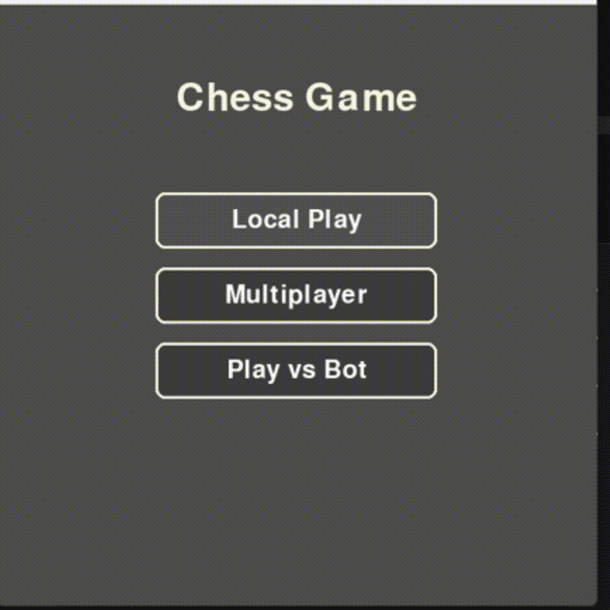

# Chess Engine & AI Framework

This project originated as a friendly competition to see who could build the best chess engine and AI from scratch. While the AI is still a work in progress, the core result is a fully functional, rules-compliant chess environment visually inspired by the clean aesthetics of Chess.com.

The engine accurately handles all complex edge cases of chess, and the long-term goal is to implement various AI models to let them compete against each other as well as implementing Multiplayer.

## Features

- **Complete FIDE Rules:** Fully supports castling, pawn promotion, and en passant.
- **Game State Detection:** Accurate check, checkmate, and stalemate validation.
- **Visual Feedback:** Interactive UI with legal move highlighting and clean graphics.
- **AI Sandbox (WIP):** Groundwork laid for plugging in custom AI agents.

    
                   
## Tech Stack

- **Language:** Python
- **Rendering:** Pygame
- **Data & Math:** NumPy
- **Machine Learning:** PyTorch (for future AI model implementations)

## Installation & Setup

### 1. Clone the repository

```bash
git clone https://github.com/potassio260/chess.git
```
And navigate to the path you cloned it to.

### 2. Install requirements

Make sure you have Python installed, then install all required libraries at once:

```bash
pip install -r requirements.txt
```

> **Note:** The `random` library is built into Python's standard library and does not need to be installed via pip.

### 3. Run the game

```bash
python main.py
```
